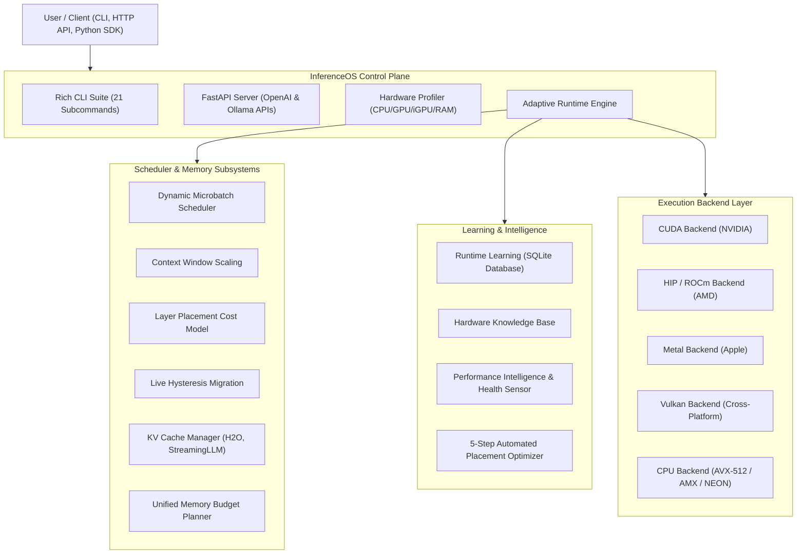
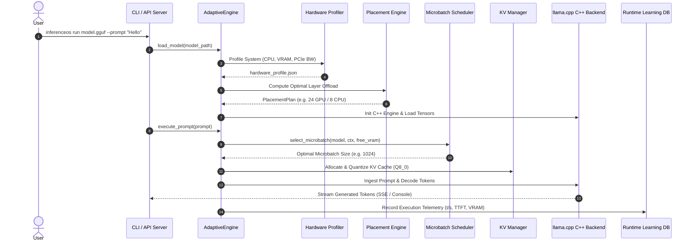

<div align="center">

# InferenceOS

### *The Hardware-Agnostic, Adaptive Operating System for Local LLM Inference*

[](https://opensource.org/licenses/MIT)
[](https://www.python.org/)
[](https://isocpp.org/)
[](https://developer.nvidia.com/cuda-zone)
[](https://www.amd.com/en/graphics/servers-rocm)
[](https://www.vulkan.org/)
[](https://developer.apple.com/metal/)
[]()
[](docs/)

[Overview](#overview) •
[Why InferenceOS](#why-inferenceos) •
[Architecture](#architecture-overview) •
[Feature Matrix](#feature-comparison) •
[Quick Start](#quick-start) •
[CLI Reference](#cli-command-reference) •
[Docs](docs/) •
[Roadmap](#roadmap) •
[Contributing](CONTRIBUTING.md)

---

</div>

## Overview

**InferenceOS** is an open-source, hardware-aware operating system and control plane designed for local Large Language Model (LLM) inference. Built on an architectural fork of [`llama.cpp`](https://github.com/ggerganov/llama.cpp), InferenceOS bridges high-performance C++ tensor execution kernels with intelligent, dynamic Python runtime orchestration.

While traditional inference runtimes rely on static offload configs and fixed microbatch sizes, **InferenceOS dynamically adapts execution in real time**. It profiles system hardware capabilities (NVIDIA, AMD, Apple Silicon, Intel Arc, and integrated GPUs), optimizes layer placement using integer linear programming cost models, dynamically sizes prefill microbatches to eliminate OOM errors, monitors live VRAM pressure to execute hysteresis-controlled layer migrations, compresses KV caches using attention-sink eviction policies (H2O, StreamingLLM), and records telemetry in a persistent SQLite Runtime Learning database.

---

## Why InferenceOS Exists

Local LLM deployment faces critical hardware boundaries:
1. **Heterogeneous System Memory**: Modern systems mix fast VRAM, system RAM, and unified iGPU memory across PCIe interconnects. Static layer offloading leads to underutilized GPUs or out-of-memory crashes.
2. **Prefill Ingestion Bottlenecks**: Prompt ingestion (prefill) requires large microbatches for throughput, but static batch sizes spike VRAM and trigger fatal OOMs.
3. **Rigid Resource Allocation**: Workloads vary dramatically between single-turn completion and extended multi-user chat sessions. Fixed memory allocations waste VRAM or truncate context windows.
4. **Lack of Feedback Loops**: Runtimes typically treat each execution as stateless, failing to learn optimal configurations across consecutive runs on identical hardware.

**InferenceOS solves these challenges** by providing an adaptive, self-tuning runtime layer over high-performance GGUF execution engines.

---

## Key Innovations & Features

- **Hardware Profiler**: Multi-vendor detection engine (NVIDIA `pynvml`/`nvidia-smi`, AMD `amdsmi`/`rocm-smi`, Apple Metal `sysctl`, Intel oneAPI/`wmic`) generating system capability profiles with automatic backend and quantization recommendations.
- **Dynamic Microbatch Scheduler**: Prefill batch scheduler using multi-heuristic scoring (VRAM headroom, prompt TPS, GPU occupancy, PCIe boundary crossings) to maximize ingestion throughput while maintaining memory safety.
- **Live Hysteresis Layer Migration**: Real-time layer offload coordinator that migrates layers between dGPU, iGPU, and CPU during active inference under dynamic memory pressure.
- **KV Cache Manager**: Advanced memory management supporting FP16/Q8_0/Q4_0 cache quantization and attention-sink eviction strategies (H2O Heavy-Hitter Oracle, StreamingLLM, LRU, FIFO).
- **Runtime Learning & Knowledge Base**: SQLite-backed feedback database recording execution telemetry (TTFT, prompt t/s, eval t/s, OOM history) and predicting optimal settings via ML regression models.
- **OpenAI & Ollama API Server**: High-throughput FastAPI HTTP server supporting `/v1/chat/completions`, `/v1/completions`, `/v1/embeddings`, and Ollama `/api/*` endpoints with streaming Server-Sent Events (SSE).
- **21-Command Rich CLI**: Interactive terminal suite including `chat`, `run`, `serve`, `benchmark`, `optimize`, `doctor`, `inspect`, `monitor`, `hardware`, and `placement`.

---

## Architecture Overview

InferenceOS separates low-level tensor execution from high-level scheduling, memory policy enforcement, and runtime learning.



### End-to-End Inference Lifecycle



---

## Feature Comparison

| Feature / Capability | InferenceOS | llama.cpp | Ollama | vLLM | ONNX Runtime |
| :--- | :---: | :---: | :---: | :---: | :---: |
| **GGUF Tensor Kernels** | Core | Native | Native | No | No |
| **Hardware Auto-Profiling** | Multi-Vendor | Manual | Basic | Basic | Basic |
| **Dynamic Microbatch Prefill** | Automated | Fixed (`-b`) | Fixed | Paged | Fixed |
| **Live Hysteresis Layer Migration** | Automated | Static | Static | No | No |
| **iGPU & Unified Memory Modeling** | Specialized | Basic | No | No | Basic |
| **KV Cache Compression (H2O/Sinks)** | Dynamic | Basic | No | Paged | No |
| **Runtime Learning (SQLite ML)** | Built-in | No | No | No | No |
| **OpenAI & Ollama Dual API Server** | Native | OpenAI | Ollama | OpenAI | No |
| **21-Command Rich Terminal TUI** | Built-in | Simple CLI | Simple CLI | No | No |

---

## Supported Hardware & Backends

| Vendor | Hardware Architecture | Recommended Backend | Supported Quantizations |
| :--- | :--- | :--- | :--- |
| **NVIDIA** | RTX 20xx/30xx/40xx, GTX 10xx, A100/H100/L40S | `cuda` (cuBLAS / FlashAttention) | Q2_K - Q8_0, FP16 |
| **AMD** | Radeon RX 6000/7000, Instinct MI200/MI300 | `rocm` / `hip` / `vulkan` | Q2_K - Q8_0, FP16 |
| **Apple** | M1 / M2 / M3 / M4 (Base, Pro, Max, Ultra) | `metal` (Unified Memory) | Q2_K - Q8_0, FP16 |
| **Intel** | Arc A-Series GPUs, Data Center GPU Flex/Max | `vulkan` / `oneapi` | Q4_0, Q8_0, FP16 |
| **Integrated** | AMD Radeon 780M/890M, Intel Iris Xe / Arc iGPU | `vulkan` (Shared RAM) | Q4_0, Q5_K_M, Q8_0 |
| **Generic** | x86_64 CPUs (AVX2, AVX-512, AMX), ARM64 (NEON) | `cpu` (OpenMP Multithreading) | Q2_K - FP16 |

---

## Quick Start

### 1. Installation

```bash
# Clone the repository
git clone https://github.com/InferenceOS/InferenceOS.git
cd InferenceOS

# Create and activate virtual environment
python -m venv .venv
# On Windows:
.venv\Scripts\activate
# On Linux/macOS:
# source .venv/bin/activate

# Install dependencies and InferenceOS CLI package in editable mode
pip install -e .
```

### 2. Profile System Hardware

```bash
# Profile CPU, GPU, VRAM, and RAM, saving profile to hardware_profile.json
inferenceos hardware
```

### 3. Single-Shot Prompt Execution

```bash
inferenceos run models/llama-3-8b-instruct.Q4_K_M.gguf --prompt "Explain quantum entanglement in 3 sentences."
```

### 4. Interactive Terminal Chat Session

```bash
inferenceos chat models/llama-3-8b-instruct.Q4_K_M.gguf --theme nord
```

### 5. Launch OpenAI & Ollama Compatible Server

```bash
inferenceos serve models/llama-3-8b-instruct.Q4_K_M.gguf --port 11434 --backend auto
```

Now call it via Standard OpenAI Client in Python:

```python
from openai import OpenAI

client = OpenAI(base_url="http://localhost:11434/v1", api_key="inferenceos")
response = client.chat.completions.create(
    model="llama-3-8b-instruct",
    messages=[{"role": "user", "content": "What makes InferenceOS adaptive?"}],
    stream=True
)

for chunk in response:
    if chunk.choices[0].delta.content:
        print(chunk.choices[0].delta.content, end="", flush=True)
```

---

## CLI Command Reference

InferenceOS provides a unified command suite accessible via `inferenceos <command>`:

```
Available Commands:
  chat        Launch interactive terminal UI chat session with live streaming
  run         Execute prompt against model with streaming output & metrics
  serve       Launch local OpenAI & Ollama compatible REST API server endpoint
  benchmark   Run end-to-end performance benchmarking matrix across batch sizes
  optimize    Automated 5-step hardware detection, placement generation & caching
  profile     Profile execution and generate interactive flamegraph HTML reports
  hardware    Inspect CPU, GPU, iGPU, VRAM, RAM, and interconnect bandwidth
  doctor      Run system diagnostic health check across drivers, SDKs, binaries
  inspect     Inspect GGUF header metadata, tensor shapes, and layer counts
  models      Register, list, inspect, tag, and manage GGUF model library
  config      View, edit, or interactively configure runtime settings
  plugins     List and manage loaded extension plugins
  cache       View or clean layer placement and benchmark optimization caches
  logs        View and tail recent runtime execution logs
  telemetry   Launch terminal metrics & historical telemetry dashboard UI
  monitor     Launch HTOP-style live process & GPU hardware resource monitor
  stats       Display aggregated performance summary statistics
  placement   Compute and visualize layer placement plan across CPU/dGPU/iGPU
  update      Check for engine updates and C++ binary builds
  version     Display InferenceOS release version and system build information
  reset       Reset configuration, profiles, and runtime caches to default state
```

For full option details per command, see [`docs/cli/command_reference.md`](docs/cli/command_reference.md).

---

## Benchmarks & Performance Philosophy

InferenceOS prioritizes **predictable safety without compromising throughput**:

1. **Zero Prefill OOM Guarantee**: The Dynamic Microbatch Scheduler evaluates VRAM headroom before prompt ingestion, scaling prefill batch size dynamically.
2. **Unified Memory Balance**: On integrated GPUs or split CPU/dGPU offloading, layer placement models transfer cost across PCIe to prevent bottlenecking the main compute pipeline.
3. **Continuous Performance Intelligence**: Feedback loops ensure repeat runs achieve higher throughput as runtime learning refines microbatch and thread allocations.

*Comprehensive benchmark methodologies and reproducible scripts are documented in [`docs/performance/benchmarks.md`](docs/performance/benchmarks.md).*

---

## Roadmap

- [x] **Phase 1 — Hardware Profiler**: Multi-vendor CPU, GPU, iGPU, VRAM, and RAM discovery (`profiler/`).
- [x] **Phase 2 — Dynamic Microbatch & KV Management**: Adaptive prefill batching, H2O attention sinks, KV quantization (`scheduler/`, `kv_manager/`).
- [x] **Phase 3 — Layer Placement & Hysteresis Migration**: ILP cost modeling and live layer migration under memory pressure (`layer_placement/`, `layer_migration/`).
- [x] **Phase 4 — Runtime Learning & HTTP Server**: SQLite execution database, prediction engine, OpenAI & Ollama dual REST API server (`runtime_learning/`, `server/`).
- [ ] **Phase 5 — Distributed Multi-Node Engine** *(In Progress)*: Pipeline parallel distribution across networked local workstations.
- [ ] **Phase 6 — Speculative Decoding Pipeline** *(Planned)*: Automated draft model speculative decoding for low-latency generation.

---

## Upstream `llama.cpp` Synergy & Attribution

InferenceOS is built with profound respect for the [`llama.cpp`](https://github.com/ggerganov/llama.cpp) open-source community created by Georgi Gerganov and contributors.

- **Kernel Execution**: InferenceOS relies on `llama.cpp` C++ tensor kernels and GGUF file parsing for maximum hardware execution efficiency.
- **Control Plane Evolution**: InferenceOS adds the adaptive operating system layer above `llama.cpp`—handling multi-vendor hardware profiling, integer linear programming placement, dynamic microbatching, live hysteresis migration, runtime learning databases, and dual API HTTP server interfaces.
- **Upstream Synchronization**: We maintain upstream compatibility with standard GGUF formats and merge updates from `llama.cpp` releases.

---

## Contributing & Governance

We welcome contributions from developers, systems engineers, researchers, and AI enthusiasts!

- Please read our [Contributing Guide](CONTRIBUTING.md) for details on code style, branch workflows, and developer tutorials.
- Abide by our [Code of Conduct](CODE_OF_CONDUCT.md) in all community interactions.
- Report security vulnerabilities following our [Security Policy](SECURITY.md).

---

## License

InferenceOS is released under the open-source **[MIT License](LICENSE)**.

---

<div align="center">

**Built for the Local AI Community.**

[Back to top](#inferenceos)

</div>
