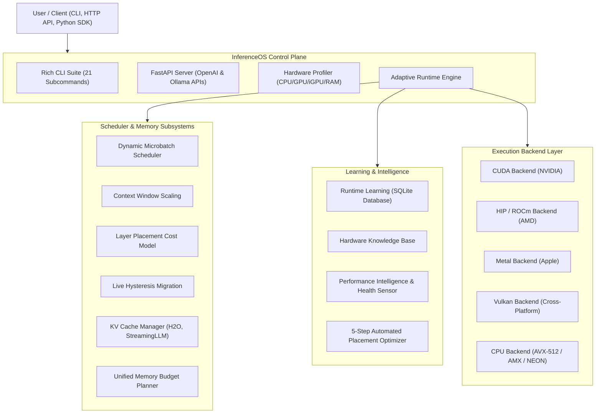

<div align="center">

# InferenceOS

### *The Hardware-Agnostic, Adaptive Operating System for Local LLM Inference*

[](https://pypi.org/project/inferenceos/)
[](https://pypi.org/project/inferenceos/)
[](https://opensource.org/licenses/MIT)
[](https://www.python.org/)
[](https://isocpp.org/)
[](https://developer.nvidia.com/cuda-zone)
[](https://www.amd.com/en/graphics/servers-rocm)
[](https://www.vulkan.org/)
[](https://developer.apple.com/metal/)
[]()
[](https://github.com/rudy-07/InferenceOS/tree/main/docs)

[PyPI Package](https://pypi.org/project/inferenceos/) •
[Overview](#overview) •
[Why InferenceOS](#why-inferenceos) •
[Architecture](#architecture-overview) •
[Feature Matrix](#feature-comparison) •
[Quick Start](#quick-start) •
[CLI Reference](#cli-command-reference) •
[Docs](docs/) •
[Roadmap](#roadmap) •
[Contributing](CONTRIBUTING.md)

---

</div>

## Overview

**InferenceOS** is an open-source, hardware-aware operating system and control plane designed for local Large Language Model (LLM) inference. Built on an architectural fork of [`llama.cpp`](https://github.com/ggerganov/llama.cpp), InferenceOS bridges high-performance C++ tensor execution kernels with intelligent, dynamic Python runtime orchestration.

Install instantly via PyPI:

```bash
pip install inferenceos
```

While traditional inference runtimes rely on static offload configs and fixed microbatch sizes, **InferenceOS dynamically adapts execution in real time**. It profiles system hardware capabilities (NVIDIA, AMD, Apple Silicon, Intel Arc, and integrated GPUs), optimizes layer placement using integer linear programming cost models, dynamically sizes prefill microbatches to eliminate OOM errors, monitors live VRAM pressure to execute hysteresis-controlled layer migrations, compresses KV caches using attention-sink eviction policies (H2O, StreamingLLM), and records telemetry in a persistent SQLite Runtime Learning database.

---

## Why InferenceOS Exists

Local LLM deployment faces critical hardware boundaries:
1. **Heterogeneous System Memory**: Modern systems mix fast VRAM, system RAM, and unified iGPU memory across PCIe interconnects. Static layer offloading leads to underutilized GPUs or out-of-memory crashes.
2. **Prefill Ingestion Bottlenecks**: Prompt ingestion (prefill) requires large microbatches for throughput, but static batch sizes spike VRAM and trigger fatal OOMs.
3. **Rigid Resource Allocation**: Workloads vary dramatically between single-turn completion and extended multi-user chat sessions. Fixed memory allocations waste VRAM or truncate context windows.
4. **Lack of Feedback Loops**: Runtimes typically treat each execution as stateless, failing to learn optimal configurations across consecutive runs on identical hardware.

**InferenceOS solves these challenges** by providing an adaptive, self-tuning runtime layer over high-performance GGUF execution engines.

---

## Key Innovations & Features

- **Hardware Profiler**: Multi-vendor detection engine (NVIDIA `pynvml`/`nvidia-smi`, AMD `amdsmi`/`rocm-smi`, Apple Metal `sysctl`, Intel oneAPI/`wmic`) generating system capability profiles with automatic backend and quantization recommendations.
- **Dynamic Microbatch Scheduler**: Prefill batch scheduler using multi-heuristic scoring (VRAM headroom, prompt TPS, GPU occupancy, PCIe boundary crossings) to maximize ingestion throughput while maintaining memory safety.
- **Live Hysteresis Layer Migration**: Real-time layer offload coordinator that migrates layers between dGPU, iGPU, and CPU during active inference under dynamic memory pressure.
- **KV Cache Manager**: Advanced memory management supporting FP16/Q8_0/Q4_0 cache quantization and attention-sink eviction strategies (H2O Heavy-Hitter Oracle, StreamingLLM, LRU, FIFO).
- **Runtime Learning & Knowledge Base**: SQLite-backed feedback database recording execution telemetry (TTFT, prompt t/s, eval t/s, OOM history) and predicting optimal settings via ML regression models.
- **OpenAI & Ollama API Server**: High-throughput FastAPI HTTP server supporting `/v1/chat/completions`, `/v1/completions`, `/v1/embeddings`, and Ollama `/api/*` endpoints with streaming Server-Sent Events (SSE).
- **21-Command Rich CLI**: Interactive terminal suite including `chat`, `run`, `serve`, `benchmark`, `optimize`, `doctor`, `inspect`, `monitor`, `hardware`, and `placement`.

---

## Architecture Overview

InferenceOS separates low-level tensor execution from high-level scheduling, memory policy enforcement, and runtime learning.



---

## Feature Comparison

| Feature / Capability | InferenceOS | llama.cpp | Ollama | vLLM | ONNX Runtime |
| :--- | :---: | :---: | :---: | :---: | :---: |
| **PyPI Package (`pip install`)** | Yes (`inferenceos`) | No | No | Yes | Yes |
| **GGUF Tensor Kernels** | Core | Native | Native | No | No |
| **Hardware Auto-Profiling** | Multi-Vendor | Manual | Basic | Basic | Basic |
| **Dynamic Microbatch Prefill** | Automated | Fixed (`-b`) | Fixed | Paged | Fixed |
| **Live Hysteresis Layer Migration** | Automated | Static | Static | No | No |
| **iGPU & Unified Memory Modeling** | Specialized | Basic | No | No | Basic |
| **KV Cache Compression (H2O/Sinks)** | Dynamic | Basic | No | Paged | No |
| **Runtime Learning (SQLite ML)** | Built-in | No | No | No | No |
| **OpenAI & Ollama Dual API Server** | Native | OpenAI | Ollama | OpenAI | No |
| **21-Command Rich Terminal TUI** | Built-in | Simple CLI | Simple CLI | No | No |

---

## Quick Start

### Option A: Install via PyPI (Recommended)

```bash
pip install inferenceos
```

### Option B: Install from Source

```bash
git clone https://github.com/rudy-07/InferenceOS.git
cd InferenceOS
python -m venv .venv
# On Windows:
.venv\Scripts\activate
# On Linux/macOS:
# source .venv/bin/activate

pip install -e .
```

### 1. Profile System Hardware

```bash
inferenceos hardware
```

### 2. Single-Shot Prompt Execution

```bash
inferenceos run models/llama-3-8b-instruct.Q4_K_M.gguf --prompt "Explain quantum entanglement in 3 sentences."
```

### 3. Interactive Terminal Chat Session

```bash
inferenceos chat models/llama-3-8b-instruct.Q4_K_M.gguf --theme nord
```

### 4. Launch OpenAI & Ollama Compatible Server

```bash
inferenceos serve models/llama-3-8b-instruct.Q4_K_M.gguf --port 11434 --backend auto
```

Call via Standard OpenAI Client in Python:

```python
from openai import OpenAI

client = OpenAI(base_url="http://localhost:11434/v1", api_key="inferenceos")
response = client.chat.completions.create(
    model="llama-3-8b-instruct",
    messages=[{"role": "user", "content": "What makes InferenceOS adaptive?"}],
    stream=True
)

for chunk in response:
    if chunk.choices[0].delta.content:
        print(chunk.choices[0].delta.content, end="", flush=True)
```

---

## CLI Command Reference

InferenceOS includes 21 dedicated subcommands accessible via `inferenceos <command>`:

| Subcommand | Syntax Example | Description |
| :--- | :--- | :--- |
| `chat` | `inferenceos chat model.gguf --theme nord` | Launch interactive terminal UI chat session with live streaming |
| `run` | `inferenceos run model.gguf -p "Hello" -b vulkan` | Execute single-shot prompt with streaming token output |
| `serve` | `inferenceos serve model.gguf --port 11434` | Launch local OpenAI (`/v1/*`) and Ollama (`/api/*`) compatible server |
| `benchmark` | `inferenceos benchmark model.gguf -t 8` | Run end-to-end performance benchmarking matrix across batch sizes |
| `optimize` | `inferenceos optimize model.gguf` | Automated 5-step hardware detection, placement generation & caching |
| `profile` | `inferenceos profile model.gguf` | Profile execution and generate interactive flamegraph HTML reports |
| `hardware` | `inferenceos hardware` | Inspect CPU, GPU, iGPU, VRAM, RAM, and interconnect bandwidth |
| `doctor` | `inferenceos doctor` | Run system diagnostic health check across drivers, SDKs, and binaries |
| `inspect` | `inferenceos inspect model.gguf` | Inspect GGUF header metadata, tensor shapes, and layer counts |
| `models` | `inferenceos models list` | Register, list, inspect, tag, and manage local GGUF model library |
| `config` | `inferenceos config --interactive` | View, edit, or interactively configure runtime settings |
| `plugins` | `inferenceos plugins` | List and manage loaded extension plugins |
| `cache` | `inferenceos cache clear` | View or clean layer placement and benchmark optimization caches |
| `logs` | `inferenceos logs -n 50` | View and tail recent runtime execution logs |
| `telemetry` | `inferenceos telemetry` | Launch terminal metrics & historical telemetry dashboard UI |
| `monitor` | `inferenceos monitor` | Launch HTOP-style live process & GPU hardware resource monitor |
| `stats` | `inferenceos stats` | Display aggregated performance summary statistics |
| `placement` | `inferenceos placement model.gguf` | Compute and visualize layer placement plan across CPU/dGPU/iGPU |
| `update` | `inferenceos update` | Check for engine updates and C++ binary builds |
| `version` | `inferenceos version` | Display InferenceOS release version and system build information |
| `reset` | `inferenceos reset` | Reset configuration, profiles, and runtime caches to default state |

---

## Python API Usage

```python
from pathlib import Path
from profiler.hardware_profiler import get_system_resources
from layer_placement import PlacementEngine, ModelDescriptor
from inference_runtime import InferenceSession, RuntimeConfig

# 1. Profile system resources
sys_res = get_system_resources()
hw_profile = sys_res.to_dict()

# 2. Build model descriptor
descriptor = ModelDescriptor.from_gguf_metadata(
    metadata={"arch": "llama", "num_layers": 32, "hidden_size": 4096},
    model_size_bytes=4 * 1024**3,
    quant_type="Q4_K_M",
    model_name="Llama-3-8B",
)

# 3. Compute optimal layer placement plan
engine = PlacementEngine(hw_profile=hw_profile)
plan = engine.generate_placement_plan(descriptor, context_length=4096)

# 4. Launch session
config = RuntimeConfig(threads=8, use_flash_attn=True)
with InferenceSession(
    model_path=Path("models/llama-3-8b.gguf"),
    plan=plan,
    config=config,
    hw_profile=hw_profile,
) as session:
    result = session.run("Explain dynamic microbatching.")
    print(result.generated_text)
    print(f"Eval Throughput: {result.stats.eval_tps:.2f} tok/s")
```

---

## Roadmap

- [x] **Phase 1 — Hardware Profiler**: Multi-vendor CPU, GPU, iGPU, VRAM, and RAM discovery (`profiler/`).
- [x] **Phase 2 — Dynamic Microbatch & KV Management**: Adaptive prefill batching, H2O attention sinks, KV quantization (`scheduler/`, `kv_manager/`).
- [x] **Phase 3 — Layer Placement & Hysteresis Migration**: ILP cost modeling and live layer migration under memory pressure (`layer_placement/`, `layer_migration/`).
- [x] **Phase 4 — Runtime Learning & HTTP Server**: SQLite execution database, prediction engine, OpenAI & Ollama dual REST API server (`runtime_learning/`, `server/`).
- [ ] **Phase 5 — Distributed Multi-Node Engine** *(In Progress)*: Pipeline parallel distribution across networked local workstations.
- [ ] **Phase 6 — Speculative Decoding Pipeline** *(Planned)*: Automated draft model speculative decoding for low-latency generation.

---

## Contributing & Governance

We welcome contributions from developers, systems engineers, researchers, and AI enthusiasts!

- Please read our [Contributing Guide](CONTRIBUTING.md) for details on code style, branch workflows, and developer tutorials.
- Abide by our [Code of Conduct](CODE_OF_CONDUCT.md) in all community interactions.
- Report security vulnerabilities following our [Security Policy](SECURITY.md).

---

## License

InferenceOS is released under the open-source **[MIT License](LICENSE)**.

---

<div align="center">

**Built for the Local AI Community.**

[Back to top](#inferenceos)

</div>
