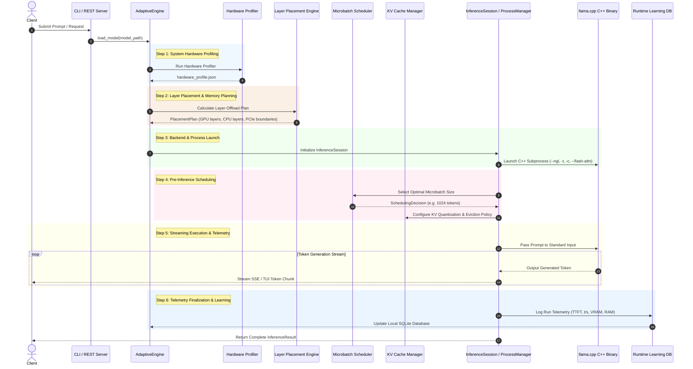

# Inference Execution Lifecycle & Flow

This document details the step-by-step execution lifecycle when an inference request is processed by InferenceOS.

---

## Complete Lifecycle Diagram

---

## Detailed Step Breakdown

### Step 1: System Hardware Profiling
1. The hardware profiler inspects the host system.
2. Interconnect speeds (PCIe bandwidth, unified RAM bus) and GPU VRAM capacities are measured.
3. System ISA capabilities (AVX2, AVX-512, AMX, Metal) are recorded in `hardware_profile.json`.

### Step 2: Layer Placement & Memory Planning
1. `GGUFParser` reads the model header (layer count, hidden dimension, head count, quantization BPW).
2. `PlacementEngine` calculates the memory required per layer.
3. An integer linear programming cost model assigns $N_{gpu}$ layers to GPU VRAM and $N_{cpu}$ layers to host RAM such that available VRAM is never exceeded.

### Step 3: Backend & Process Launch
1. `BackendSelector` matches system capabilities against backend hints (`cuda`, `rocm`, `vulkan`, `metal`, `cpu`).
2. `ArgumentBuilder` constructs the exact CLI flags (`-ngl`, `-t`, `-c`, `-b`, `--flash-attn`).
3. `ProcessManager` spawns the `llama.exe` binary in an isolated subprocess.

### Step 4: Pre-Inference Dynamic Scheduling
1. `MicrobatchScheduler` evaluates candidate prefill batch sizes against remaining VRAM headroom.
2. `IntelligentKVManager` initializes attention-sink eviction windows (H2O or StreamingLLM) if context exceeds cache bounds.

### Step 5: Streaming Execution & Telemetry
1. Prompt tokens are ingested by the execution backend.
2. Standard output is consumed character-by-character by a dedicated background thread.
3. Per-token arrival timestamps are recorded to compute latency percentiles ($p50$, $p95$, $p99$).
4. System utilization (CPU %, GPU %, VRAM MB) is sampled at configurable intervals.

### Step 6: Telemetry Finalization & Learning
1. Subprocess completion status is verified.
2. Detailed run stats (`prompt_eval_tps`, `eval_tps`, `time_to_first_token_ms`) are parsed from `stderr`.
3. Execution details are persisted into `runtime_learning.db` to train predictive recommendation models for subsequent runs.
