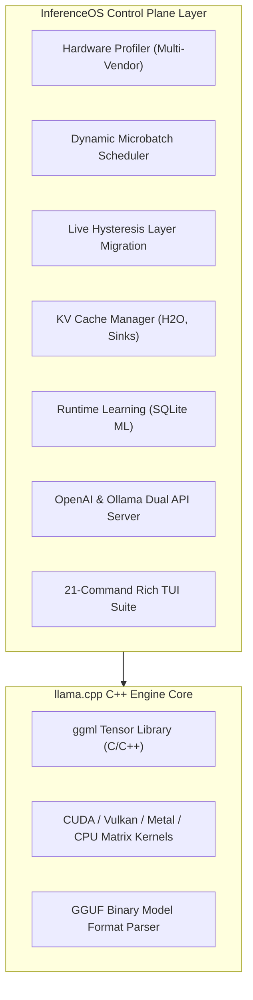

# Upstream `llama.cpp` Fork & Architectural Differences

InferenceOS is built on a specialized architectural fork of [`llama.cpp`](https://github.com/ggerganov/llama.cpp). This document outlines why `llama.cpp` was selected, what InferenceOS extends, how upstream updates are merged, and our contribution policies regarding upstream code.

---

## Why `llama.cpp` Was Forked

`llama.cpp` is the gold standard for C++ tensor kernel execution for GGUF-formatted quantized Large Language Models. It offers:
- Zero-dependency, portable C++20 matrix multiplication kernels.
- Hardware backends for CUDA, ROCm/HIP, Vulkan, Apple Metal, OpenCL, and CPU vector extensions (AVX2, AVX-512, AMX, NEON).
- Wide community support and rapid adaptation to new GGUF model architectures.

However, `llama.cpp` was designed primarily as a low-level execution engine rather than an adaptive, self-tuning operating system control plane.

---

## What InferenceOS Extends

InferenceOS builds the **Control Plane & Adaptive Runtime Operating System** above the `llama.cpp` execution kernels:

### Key Architectural Differences

| Subsystem | Standard `llama.cpp` | InferenceOS Extension |
| :--- | :--- | :--- |
| **Prefill Microbatch** | Static CLI parameter (`-b 512`) | Dynamic Microbatch Scheduler evaluates VRAM headroom in real-time before ingestion |
| **Layer Placement** | Static layer offload (`-ngl N`) | Integer linear programming (ILP) cost model balancing VRAM, RAM, and PCIe bandwidth |
| **Layer Migration** | Static throughout runtime execution | Live Hysteresis Layer Migration shifts layers dynamically under memory pressure |
| **KV Cache Management** | Ring buffer context truncation | H2O Heavy-Hitter Oracle & StreamingLLM attention-sink eviction with FP16/Q8_0/Q4_0 quantization |
| **Runtime Intelligence** | Stateless (no execution history) | SQLite Runtime Learning Engine recording execution telemetry and fitting ML prediction models |
| **API Server** | Standalone C++ server | FastAPI Python server supporting dual OpenAI `/v1/*` and Ollama `/api/*` endpoints |

---

## Upstream Synchronization Policy

1. **GGUF Compatibility**: InferenceOS maintains 100% binary compatibility with standard GGUF model files generated by `llama.cpp` tools (`convert.py`, `llama-quantize`).
2. **Upstream Merges**: We regularly track and merge upstream `llama.cpp` release tags into our core binary execution layer to inherit performance optimizations and new model architecture support.
3. **Upstream Contributions**: Non-adaptive, generic kernel optimizations or bug fixes discovered within InferenceOS are submitted back to the upstream `llama.cpp` repository whenever applicable.
