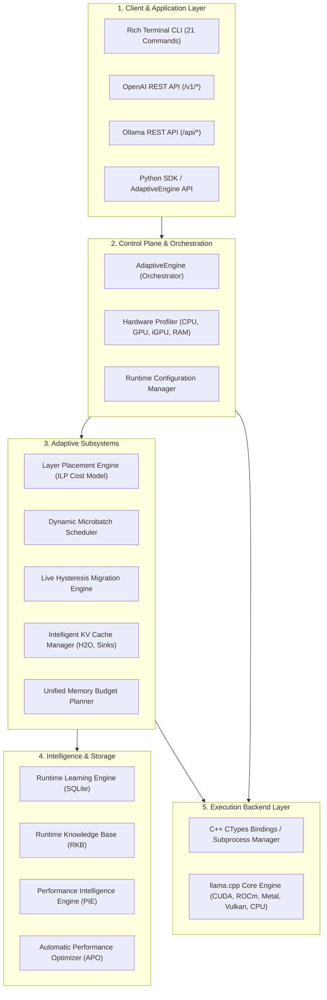

# Architecture Overview & Control Plane Design

InferenceOS is architected as a modular control plane operating above high-performance C++ LLM inference engines. It shifts LLM inference from static, hard-coded execution to an adaptive, hardware-aware operating environment.

---

## High-Level Component Stack

---

## Subsystem Responsibilities

### 1. Control Plane (`orchestrator/`, `inference_runtime/`)
The Control Plane supervises model loading, dynamic backend discovery, subprocess lifecycle management, and stdout/stderr metric collection.
- **`AdaptiveEngine`**: Primary python entry point that loads hardware profiles, parses GGUF headers, calculates memory bounds, and delegates execution.
- **`ProcessManager`**: Manages subprocess execution, streaming stdout line-by-line via asynchronous reader threads, and tracking per-token arrival timestamps.

### 2. Schedulers (`scheduler/`, `async_scheduler/`)
Schedulers compute safe execution bounds prior to and during prompt execution:
- **Dynamic Microbatch Scheduler**: Evaluates candidate prefill batch sizes ($B \in [32, 2048]$) using candidate scoring matrices to prevent prefill VRAM spikes.
- **Context Scheduler**: Auto-scales maximum safe context window lengths ($N_{ctx}$) based on available VRAM/RAM.
- **Async Pipeline Coordinator**: Manages CUDA streams, prefetching, and async worker thread pools.

### 3. Layer Placement & Live Migration (`layer_placement/`, `layer_migration/`, `igpu_support/`)
- **Placement Engine**: Solves integer linear programming (ILP) formulation to place transformer layers across available compute units (dGPU, iGPU, CPU) while minimizing PCIe transfer costs.
- **Migration Engine**: Observes live VRAM pressure during inference. If pressure crosses hysteresis thresholds, layers are dynamically migrated between GPU and CPU without dropping context.

### 4. KV Cache Manager (`kv_manager/`)
- Manages memory allocation for Key-Value attention caches.
- Features attention-sink eviction policies (H2O Heavy-Hitter Oracle, StreamingLLM) to retain fixed memory footprints for long sequences.
- Supports KV cache quantization (`FP16`, `Q8_0`, `Q4_0`).

### 5. Runtime Learning & Intelligence (`runtime_learning/`, `runtime_kb/`, `performance_intelligence/`)
- **Runtime Learning Engine**: Stores execution telemetry in a local SQLite database (`runtime_learning.db`), fitting predictive regression models to recommend microbatches and thread counts for future runs.
- **Performance Intelligence Engine (PIE)**: Tracks baseline throughputs (`prompt_tps`, `eval_tps`, `TTFT`), detects performance regressions, and monitors system thermal/OOM health.

---

## Design Philosophy

1. **Safety First**: Never crash with Out-Of-Memory (OOM). If VRAM is constrained, downscale prefill microbatches or offload excess layers to system RAM.
2. **Hardware Awareness**: Hardware parameters (VRAM, memory bandwidth, PCIe speed, CPU ISA) are discovered automatically, not manually hardcoded.
3. **Decoupled Architecture**: High-level policy decisions (Python control plane) are cleanly isolated from low-level matrix multiplication kernels (C++ backends).
4. **Self-Improving**: Repeat runs on identical hardware leverage historical learning to optimize performance without manual tuning.
