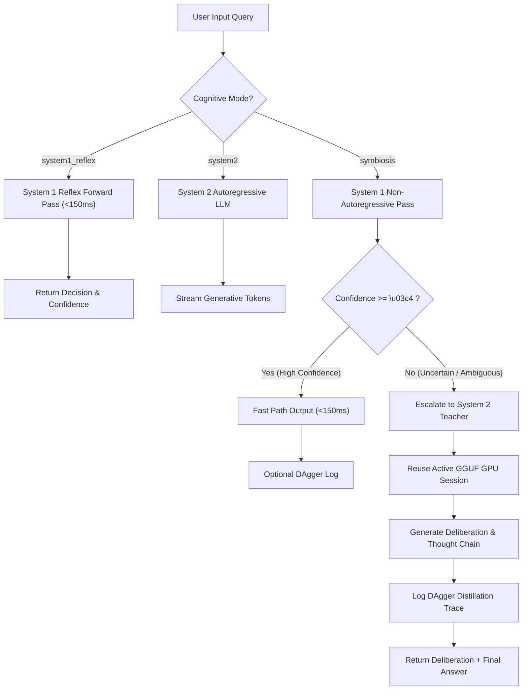

# System 1 & System 2 Hybrid Symbiosis Architecture

## Overview

Traditional AI inference pipelines treat every prompt uniformly—either forcing every query through an expensive, multi-billion parameter autoregressive Large Language Model (System 2), or relying purely on static heuristic classifiers that fail on open-ended creative tasks.

**InferenceOS 1.1.0** introduces the **Kahneman Fast/Slow Cognitive Symbiosis Loop**, marrying:
- **System 1 (Fast Reflex)**: Non-autoregressive encoder-based classification models (such as Laya mmBERT and Kev pointer-head networks) providing sub-150ms instant decisions with **zero KV cache memory overhead**.
- **System 2 (Deep Reasoning)**: Autoregressive generative LLMs (e.g. Qwen, LLaMA, DeepSeek, Mistral) orchestrated via GGUF execution backends on Vulkan, CUDA, ROCm, or Metal.



---

## Memory & Hardware Placement Model

Running dual models in local environments often risks Out-Of-Memory (OOM) crashes or GPU context thrashing. InferenceOS resolves this through distinct memory boundaries:

1. **System 1 Models**:
   - Zero KV Cache requirement (single forward transformer pass).
   - Placed on DirectML/CUDA GPU or pinned system RAM with negligible memory consumption (~100MB to 500MB).
2. **System 2 Models**:
   - Managed by the `AdaptiveEngine` and `MicrobatchScheduler`.
   - VRAM dynamically partitioned between model weights, active context window, and quantized KV caches (Q8_0, FP16).
3. **In-Memory Session Escalation**:
   - When escalating from System 1 to System 2 in hybrid mode, `HybridOrchestrator` passes the query directly into the active in-memory session (`system2_session`), eliminating dual-Vulkan engine initialization latency and preventing VRAM duplication.

---

## Confidence Gating ($\tau$) & Fallback Strategy

The confidence threshold $\tau$ (controlled via `--tau`, default `0.85` or dynamic in-TUI `/tau <float>`) governs the decision boundary:

$$\text{Decision Path} = \begin{cases} 
\text{System 1 Reflex}, & \text{if } C(x) \ge \tau \\ 
\text{System 2 Deliberation}, & \text{if } C(x) < \tau 
\end{cases}$$

- If System 1 produces an empty classification, out-of-vocabulary token, or low confidence, it safely falls back without throwing exceptions.
- System 2 synthesizes the reasoning prompt and provides a detailed step-by-step breakdown.

---

## DAgger (Dataset Aggregation) Distillation Pipeline

Every escalation event records an imitation learning trace:
```json
{
  "timestamp": 1759325400,
  "query": "Is this transaction compliant with Section 4.2?",
  "system1_prediction": "ambiguous",
  "system1_confidence": 0.42,
  "escalated": true,
  "system2_output": "The transaction complies with Section 4.2 because...",
  "status": "escalated_to_teacher"
}
```

Export live traces directly from the chat TUI:
```bash
/dagger export datasets/distillation_v1.jsonl
```

These traces can then be utilized to fine-tune System 1 student models to continuously expand their high-confidence decision domain.

---

## REST API Integration

System 1 endpoints are served natively by the InferenceOS FastAPI server:

- `POST /v1/system1/decide`: Execute single-shot non-autoregressive decision pass.
- `GET /v1/system1/models`: List available System 1 fast-reflex models.
- `POST /v1/hybrid/deliberate`: Execute dual-system deliberation with automatic confidence escalation.
