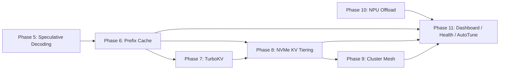

# InferenceOS — Extended Feature Implementation Plan

> **Scope**: Seven major feature pillars added on top of the existing InferenceOS architecture. All features are implemented as **opt-in, configurable extensions** via `RuntimeConfig`, `pipeline_config.json`, and the unified CLI. Each phase is independent and can ship separately.

---

## Architecture Integration Principles

Every new feature must follow the existing InferenceOS patterns:
- **`RuntimeConfig` (inference_runtime/runtime_config.py)**: All new features get their own configuration block with `enable_*` flags, mode selectors, and `verbose_*` debug flags.
- **`pipeline_config.json`**: High-level JSON configuration for cluster, NPU, and dashboard settings (persisted user preferences).
- **CLI registration (`cli/main.py`)**: New subcommands added to the 21-command suite.
- **Runtime Learning DB (`runtime_learning/database.py`)**: Telemetry from new systems flows into the existing SQLite schema.
- **Health Monitor (`runtime_health/`)**: Thermal/OOM safeguards are extended, not replaced.

---

## Phase 5 — Advanced Speculative Decoding Suite

**Target Modules**: `speculative_decoding/` (new), `inference_runtime/runtime_engine.py`, `inference_runtime/runtime_config.py`, `scheduler/microbatch_scheduler.py`, `cli/main.py`

**Goal**: Transparent 1.5×–2.5× token throughput improvement via prompt-lookup/n-gram draft generation and an Eagle-2/Medusa-style multi-head draft engine, both configurable independently.

### Sub-System A — Prompt-Lookup & N-Gram Speculation

This sub-system requires **zero additional VRAM** because it derives draft tokens purely from the existing context and prompt buffers.

#### [NEW] `speculative_decoding/__init__.py`
Package init — exports `SpeculativeDecoderConfig`, `NGramSpeculator`, `EagleDraftEngine`, `SpeculativeOrchestrator`.

#### [NEW] `speculative_decoding/config.py`
```python
@dataclass
class SpeculativeDecoderConfig:
    enabled: bool = False
    mode: str = "ngram"           # "ngram" | "prompt_lookup" | "eagle" | "medusa" | "auto"
    draft_tokens: int = 5          # number of draft tokens per forward pass
    ngram_size: int = 3            # n-gram window (2–6)
    acceptance_threshold: float = 0.8   # min acceptance probability
    fallback_to_greedy: bool = True
    eagle_draft_model_path: Optional[str] = None   # path to Eagle draft heads GGUF
    medusa_heads: int = 4          # number of Medusa parallel heads
    verbose_spec_decoder: bool = False
```

#### [NEW] `speculative_decoding/ngram_speculator.py`
- Maintains a **sliding ring buffer** of the last N generated tokens.
- `generate_drafts(context_ids, n_drafts)` → searches the prompt + prior output for the longest n-gram suffix match and returns candidate token sequences.
- `score_acceptance(draft_tokens, verified_logits)` → computes acceptance probability using the token's position in the base model's top-k logits.
- Zero-copy: operates entirely on Python `deque` + numpy arrays — no GPU memory needed.

#### [NEW] `speculative_decoding/prompt_lookup_speculator.py`
- Implements the Prompt-Lookup Decoding paper: searches the *input prompt* for matches to the last K generated tokens.
- Returns candidate continuations from within the prompt — extremely effective for RAG, document summarization, and code completion.
- Configurable `lookup_window` (default: full prompt) and `min_match_length` (default: 3).

#### [NEW] `speculative_decoding/eagle_draft_engine.py`
- Loads a lightweight draft GGUF model (Eagle-2 draft heads or Medusa heads checkpoint).
- Uses InferenceOS's existing `InferenceSession` to run the draft model in a **dedicated async worker** from `async_scheduler/worker_pool.py`.
- `generate_draft_sequence(hidden_states, n_drafts)` → produces `draft_tokens` candidate sequences in parallel.
- `TreeAttentionVerifier` applies tree-structured verification in a single forward pass through the base model.

#### [NEW] `speculative_decoding/orchestrator.py`
```
SpeculativeOrchestrator
 ├── select_backend()         # auto-select ngram / prompt_lookup / eagle based on mode
 ├── run_speculative_loop()   # main draft → verify → accept/reject loop
 ├── record_acceptance_stats() → runtime_learning DB
 └── report_speedup()
```
- Hooks into `InferenceSession.run()` in `inference_runtime/inference_session.py` as a **strategy object** — the base model engine calls `orchestrator.run_speculative_loop()` instead of raw decode.
- Acceptance telemetry written to `runtime_learning/database.py` with schema extension: `spec_acceptance_rate`, `spec_speedup_ratio`, `draft_mode`.

#### [MODIFY] `inference_runtime/runtime_config.py`
Add new configuration block:
```python
# ── Phase 5: Speculative Decoding ─────────────────────────────────────────
enable_speculative_decoding: bool = False
spec_mode: str = "auto"           # "ngram" | "prompt_lookup" | "eagle" | "medusa" | "auto"
spec_draft_tokens: int = 5
spec_ngram_size: int = 3
spec_acceptance_threshold: float = 0.8
spec_eagle_draft_model: Optional[str] = None
spec_medusa_heads: int = 4
verbose_spec_decoding: bool = False
```

#### [MODIFY] `inference_runtime/runtime_engine.py`
- After model load and placement plan resolution, instantiate `SpeculativeOrchestrator` if `config.enable_speculative_decoding`.
- Pass orchestrator into `InferenceSession` constructor.

#### [MODIFY] `cli/main.py`
Add `--speculative` / `--spec-mode` / `--draft-tokens` flags to `run`, `chat`, and `serve` commands.
New subcommand: `inferenceos speculative` — inspect acceptance rates, draft model status, and speedup ratios from the runtime learning DB.

#### [MODIFY] `runtime_learning/database.py`
Extend the telemetry schema with a `speculative_stats` table.

---

### Verification Plan – Phase 5
- Run `inferenceos benchmark --spec-mode ngram` vs. baseline and compare eval t/s.
- Validate zero-VRAM overhead by running `inferenceos monitor` during speculation.
- Test Eagle mode with a valid Qwen3-0.6B draft model GGUF.

---

## Phase 6 — Radix-Tree Prefix Caching (Paged KV Attention)

**Target Modules**: `kv_manager/` (extend), `prefix_cache/` (new), `inference_runtime/runtime_config.py`, `server/` (session affinity), `cli/main.py`

**Goal**: Eliminate redundant prefill computation for repeated system prompts, shared RAG context, and multi-turn chat history. First-turn TTFT stays high; all subsequent turns with a shared prefix get **near-instant TTFT**.

#### [NEW] `prefix_cache/__init__.py`
Exports `RadixPrefixCache`, `PrefixCacheConfig`, `PagedKVBlock`, `CacheBlockAllocator`.

#### [NEW] `prefix_cache/config.py`
```python
@dataclass
class PrefixCacheConfig:
    enabled: bool = False
    max_cache_blocks: int = 512       # total paged KV blocks to maintain
    block_size_tokens: int = 16       # tokens per KV block (vLLM standard)
    max_prefix_length: int = 4096     # max cacheable prefix length (tokens)
    eviction_policy: str = "lru"      # "lru" | "lfu" | "ttl"
    ttl_seconds: float = 300.0        # time-to-live for cached blocks
    cache_system_prompts: bool = True
    cache_rag_context: bool = True
    persist_to_disk: bool = False     # serialize block table to ~/.inferenceos/prefix_cache/
    verbose_prefix_cache: bool = False
```

#### [NEW] `prefix_cache/paged_block.py`
- `PagedKVBlock`: Immutable value object representing a contiguous slice of the KV cache covering `block_size_tokens` tokens.
- Fields: `block_id`, `token_ids` (tuple, hashable), `kv_data_ptr` (memory address or mmap offset), `ref_count`, `last_access_ts`.

#### [NEW] `prefix_cache/radix_tree.py`
```
RadixTree
 ├── insert(token_sequence, block_chain)   # insert a prefix → block mapping
 ├── prefix_match(token_sequence)          # O(prefix_len) longest prefix lookup
 ├── evict_lru(n_blocks)                   # free least-recently-used blocks
 └── stats()                               # hit rate, total blocks, eviction count
```
- The radix tree stores **shared prefixes** — multiple chat sessions referencing the same system prompt share the same node without duplication.
- Thread-safe via `threading.RLock` for concurrent server sessions.

#### [NEW] `prefix_cache/block_allocator.py`
- Manages a fixed pool of `PagedKVBlock` slots (pre-allocated VRAM/RAM slabs).
- `allocate_blocks(n)` → returns free block IDs.
- `free_blocks(block_ids)` → returns blocks to the pool.
- Integrates with `memory_manager/unified_memory_manager.py` for tier-aware allocation (VRAM-first, RAM fallback).

#### [NEW] `prefix_cache/cache_manager.py`
- `PrefixCacheManager` facade:
  - `compute_prefix_hash(token_ids)` → SHA-256 of token sequence for fast lookup.
  - `lookup(token_ids)` → returns `(matched_blocks, matched_length)`.
  - `store(token_ids, kv_block_chain)` → inserts into radix tree.
  - `invalidate(prefix_hash)` → removes stale entries.
  - Emits cache-hit/miss telemetry to `runtime_learning/database.py`.

#### [MODIFY] `kv_manager/manager.py`
- `IntelligentKVManager.evaluate_kv_state()` receives an optional `prefix_cache_hit_mb` parameter — if a prefix cache hit occurred, the KV memory estimate is reduced accordingly.
- New method: `register_prefix_cache(cache_manager: PrefixCacheManager)`.

#### [MODIFY] `inference_runtime/runtime_config.py`
```python
# ── Phase 6: Radix-Tree Prefix Cache ──────────────────────────────────────
enable_prefix_cache: bool = False
prefix_cache_max_blocks: int = 512
prefix_cache_block_size: int = 16
prefix_cache_max_prefix_len: int = 4096
prefix_cache_eviction: str = "lru"
prefix_cache_ttl_sec: float = 300.0
prefix_cache_persist: bool = False
verbose_prefix_cache: bool = False
```

#### [MODIFY] `server/` — Session Affinity
- `server/sessions/` session manager extended with `session_prefix_hash` tracking.
- Incoming `/v1/chat/completions` requests with identical system prompts are routed to the same block allocator pool, guaranteeing prefix cache hits across users.

#### [MODIFY] `cli/main.py`
New subcommand: `inferenceos cache` extended with `--prefix-stats` flag showing hit rate, block utilization, and memory saved.

---

### Verification Plan – Phase 6
- Run two consecutive chat turns with a 2048-token system prompt; confirm second-turn TTFT is <50ms.
- Stress test with 10 concurrent server sessions sharing the same system prompt.
- Verify `inferenceos cache --prefix-stats` correctly reports hit rate.

---

## Phase 7 — Ultra-Low Precision KV Cache (TurboKV Quantization)

**Target Modules**: `kv_manager/quantization.py` (extend), `kv_manager/turbo_kv/` (new), `inference_runtime/runtime_config.py`

**Goal**: Reduce KV cache VRAM footprint by up to 75% using Q3_K/Q2_K/TurboKV quantization with outlier-channel protection, enabling 128k+ context windows on 12–16GB VRAM systems.

### Current State
`kv_manager/quantization.py` already supports FP16, Q8_0, Q4_0. This phase extends to Q3_K, Q2_K, and a custom TurboKV format.

#### [NEW] `kv_manager/turbo_kv/__init__.py`
Exports `TurboKVQuantizer`, `OutlierChannelDetector`, `TurboKVConfig`.

#### [NEW] `kv_manager/turbo_kv/config.py`
```python
@dataclass
class TurboKVConfig:
    format: str = "Q4_0"         # "Q8_0" | "Q4_0" | "Q3_K" | "Q2_K" | "TurboKV_2bit" | "adaptive"
    outlier_threshold: float = 6.0    # activations exceeding N std-devs kept in FP16
    outlier_ratio: float = 0.01       # max fraction of channels in FP16 (1% default)
    per_channel_scales: bool = True   # per-channel vs per-tensor scale factors
    dynamic_precision: bool = False   # auto-select format per-layer based on attention entropy
    verbose_turbokv: bool = False
```

#### [NEW] `kv_manager/turbo_kv/outlier_detector.py`
- `OutlierChannelDetector.calibrate(sample_activations)` → computes per-channel mean and std-dev from a calibration run.
- `identify_outlier_channels(activation_tensor)` → returns a boolean mask of channels exceeding `outlier_threshold × std_dev`.
- These channels are **kept in FP16** while remaining channels are quantized to the target format — this preserves attention quality in critical attention heads (phenomenon observed in LLM.int8() and SmoothQuant papers).

#### [NEW] `kv_manager/turbo_kv/quantizer.py`
- `TurboKVQuantizer.quantize(kv_tensor, format, outlier_mask)` → returns quantized KV tensor + FP16 outlier shard.
- `dequantize(quantized_kv, outlier_shard, scale_factors)` → reconstructs FP16 KV for attention computation.
- Implements NF4 (normalized float 4-bit) grid for Q4_0 and custom 2-bit absmax grid for TurboKV_2bit.

#### [NEW] `kv_manager/turbo_kv/entropy_monitor.py`
For `dynamic_precision` mode: measures per-layer attention entropy during inference. Low-entropy layers (less information-dense) are quantized more aggressively; high-entropy layers retain higher precision. Updates per-session based on observed entropy patterns.

#### [MODIFY] `kv_manager/quantization.py`
- Refactored: existing `KVQuantizer` becomes a thin dispatcher that delegates to `TurboKVQuantizer` for formats Q3_K and below.
- Backward compatible: existing Q8_0/Q4_0 paths unchanged.

#### [MODIFY] `kv_manager/manager.py`
- `evaluate_kv_state()` extended: when `pressure_level == "Critical"` and context > 32k tokens, `TurboKVQuantizer` is invoked automatically in place of standard compression.
- New method: `calibrate_outlier_channels(model_metadata)` — runs a short warmup inference and calibrates the `OutlierChannelDetector`.

#### [MODIFY] `inference_runtime/runtime_config.py`
```python
# ── Phase 7: TurboKV Ultra-Low Precision ──────────────────────────────────
kv_turbokv_enabled: bool = False
kv_turbokv_format: str = "adaptive"  # "Q8_0"|"Q4_0"|"Q3_K"|"Q2_K"|"TurboKV_2bit"|"adaptive"
kv_turbokv_outlier_threshold: float = 6.0
kv_turbokv_outlier_ratio: float = 0.01
kv_turbokv_per_channel_scales: bool = True
kv_turbokv_dynamic_precision: bool = False
verbose_turbokv: bool = False
```

#### [MODIFY] `cli/main.py`
Add `--kv-format` flag to `run`, `chat`, `serve`. Extend `inferenceos kv` subcommand with `--turbo-stats` showing compression ratio per layer.

---

### Verification Plan – Phase 7
- Load a 70B model Q4_K_M at 128k context on a 24GB VRAM system with TurboKV_2bit enabled; confirm no OOM.
- Compare perplexity (via `inferenceos benchmark --perplexity`) between FP16 KV and TurboKV_2bit — target <5% perplexity degradation.
- Monitor acceptance rates in speculative decoding with ultra-low KV precision.

---

## Phase 8 — Virtual Memory Swap & NVMe Tiering for KV Cache

**Target Modules**: `kv_manager/tiering/` (new), `memory_manager/unified_memory_manager.py` (extend), `layer_migration/` (integrate), `inference_runtime/runtime_config.py`

**Goal**: Extend the existing 2-tier memory model (VRAM→RAM) to a full 3-tier KV cache hierarchy: **VRAM (Tier 0) → System RAM (Tier 1) → High-Speed NVMe SSD (Tier 2)**. Cold KV blocks page out asynchronously; hot blocks are promoted on demand.

### Current State
`memory_manager/unified_memory_manager.py` already manages VRAM↔RAM with `MemoryTier.TIER_1_VRAM` and `MemoryTier.TIER_2_RAM`. `layer_migration/migration_engine.py` handles live tensor movement. This phase adds Tier 3 (NVMe) specifically for KV blocks and creates an asynchronous paging daemon.

#### [NEW] `kv_manager/tiering/__init__.py`
Exports `TieredKVCacheManager`, `KVBlockPageDaemon`, `NVMeKVStore`, `TieringConfig`.

#### [NEW] `kv_manager/tiering/config.py`
```python
@dataclass
class TieringConfig:
    enabled: bool = False
    nvme_cache_dir: str = "~/.inferenceos/kv_nvme_cache"
    max_nvme_cache_gb: float = 50.0      # NVMe storage budget
    nvme_block_size_mb: float = 64.0     # atomic paging unit
    vram_high_watermark: float = 0.85    # trigger eviction from VRAM→RAM at 85%
    vram_low_watermark: float = 0.70     # stop eviction below 70%
    ram_high_watermark: float = 0.80     # trigger eviction from RAM→NVMe at 80%
    ram_low_watermark: float = 0.65
    paging_threads: int = 2              # async paging I/O threads
    prefetch_blocks_ahead: int = 4       # blocks to prefetch from NVMe before needed
    compression_on_nvme: bool = True     # LZ4 compress blocks before writing to NVMe
    verbose_tiering: bool = False
```

#### [NEW] `kv_manager/tiering/nvme_store.py`
- `NVMeKVStore`: manages a flat directory of `{block_id}.kv` files (optionally LZ4-compressed) on a configured NVMe path.
- Uses `mmap` for direct-to-RAM page mapping and `aiofiles` for async write-back.
- `write_block_async(block_id, kv_data)` → non-blocking write.
- `read_block_async(block_id)` → non-blocking read with prefetch hint.
- Block manifest: SQLite table in the same directory tracking block ID → file path → size → access timestamp.

#### [NEW] `kv_manager/tiering/page_daemon.py`
`KVBlockPageDaemon` — background daemon thread running alongside inference:
- **Eviction Loop**: Polls VRAM and RAM utilization every 100ms. When `vram_high_watermark` exceeded:
  1. Identifies LRU KV blocks from the `PagedKVBlock` pool (from Phase 6 `prefix_cache/block_allocator.py` or standalone block tracker).
  2. Copies cold blocks to RAM (if RAM below `ram_high_watermark`) or directly to NVMe.
  3. Releases VRAM slab.
- **Prefetch Loop**: When a KV block not in VRAM is accessed:
  1. Reads from RAM immediately if present.
  2. Launches async NVMe read for blocks in NVMe tier.
  3. Prefetches `prefetch_blocks_ahead` subsequent blocks speculatively.
- Integrates with `layer_migration/hysteresis_controller.py` — uses the same hysteresis thresholds to avoid rapid tier oscillation.

#### [NEW] `kv_manager/tiering/tiered_manager.py`
`TieredKVCacheManager` — extends `IntelligentKVManager`:
- Wraps block allocation/deallocation with tier-aware tracking.
- `get_block(block_id)` → transparent: returns block from VRAM, promotes from RAM/NVMe if necessary.
- `flush_cold_blocks()` → manual trigger for eviction (exposed via CLI).
- Exposes `get_tier_stats()` → VRAM/RAM/NVMe block counts and utilization.

#### [MODIFY] `memory_manager/memory_tier.py`
Add `TIER_3_NVME = "nvme"` to `MemoryTier` enum with `is_active_inference_memory = True` (KV blocks on NVMe are still "active" — just cold).

#### [MODIFY] `memory_manager/unified_memory_manager.py`
- `allocateTensor()` extended: when both VRAM and RAM are full, for KV cache tensors (identified by `dtype="kv_block"`), fall through to Tier 3 NVMe via `TieredKVCacheManager`.
- `moveTensor()` accepts `TIER_3_NVME` as a valid target.

#### [MODIFY] `layer_migration/migration_engine.py`
Minor extension: `MigrationEngine` can now trigger KV block paging via `TieredKVCacheManager` as part of memory pressure relief, complementing existing layer offloading.

#### [MODIFY] `inference_runtime/runtime_config.py`
```python
# ── Phase 8: NVMe KV Tiering ──────────────────────────────────────────────
enable_kv_tiering: bool = False
kv_tiering_nvme_dir: str = "~/.inferenceos/kv_nvme_cache"
kv_tiering_max_nvme_gb: float = 50.0
kv_tiering_vram_high_wm: float = 0.85
kv_tiering_ram_high_wm: float = 0.80
kv_tiering_paging_threads: int = 2
kv_tiering_prefetch_ahead: int = 4
kv_tiering_compress_nvme: bool = True
verbose_kv_tiering: bool = False
```

#### [MODIFY] `cli/main.py`
Extend `inferenceos cache` with `--tier-stats` showing VRAM/RAM/NVMe block counts and I/O bandwidth. New flag `inferenceos cache --flush-nvme` manually evicts NVMe tier.

---

### Verification Plan – Phase 8
- Load a model requiring 128k context on a system with 8GB VRAM + 32GB RAM + NVMe: confirm inference completes without OOM by paging KV blocks to NVMe.
- Measure NVMe read latency impact on inter-token generation speed.
- Confirm `KVBlockPageDaemon` correctly applies hysteresis (no oscillation between tiers).

---

## Phase 9 — Peer-to-Peer Heterogeneous Cluster Mesh (Multi-Node Engine)

**Target Modules**: `cluster/` (new), `layer_placement/` (extend), `inference_runtime/runtime_engine.py`, `async_scheduler/pipeline_coordinator.py`, `cli/main.py`, `pipeline_config.json`

**Goal**: Pool GPU/CPU resources across networked machines on a LAN into a single logical inference engine. The existing ILP-based `layer_placement/optimizer.py` is extended to reason about network bandwidth and node heterogeneity.

### Architecture

```
Node A (Master — RTX 4080 12GB)               Node B (Worker — M2 MacBook 16GB)
┌──────────────────────────────┐               ┌──────────────────────────────┐
│  ClusterMaster               │  gRPC mTLS    │  ClusterWorker               │
│  ├── NodeDiscovery           │◄─────────────►│  ├── WorkerServer            │
│  ├── ClusterPlacementSolver  │               │  ├── LayerExecutionPool      │
│  └── DistributedScheduler    │               │  └── KVTransferReceiver      │
│                              │               │                              │
│  Layers 0–28 (CUDA)          │    Token IDs  │  Layers 28–40 (Metal)        │
│  llama.cpp CUDA backend      │◄─────────────►│  llama.cpp Metal backend     │
└──────────────────────────────┘               └──────────────────────────────┘
```

#### [NEW] `cluster/__init__.py`
Exports `ClusterConfig`, `ClusterMaster`, `ClusterWorker`, `NodeDescriptor`, `ClusterPlacementSolver`, `DistributedScheduler`.

#### [NEW] `cluster/config.py`
```python
@dataclass
class ClusterConfig:
    enabled: bool = False
    role: str = "standalone"          # "standalone" | "master" | "worker"
    master_host: str = "0.0.0.0"
    master_port: int = 50051          # gRPC port
    worker_hosts: List[str] = field(default_factory=list)  # ["192.168.1.101:50051", ...]
    auth_token: str = ""              # shared secret for mTLS
    network_bandwidth_gbps: float = 1.0   # LAN bandwidth estimate (auto-detected if 0.0)
    pipeline_parallel: bool = True    # pipeline parallelism (layer sharding across nodes)
    tensor_parallel: bool = False     # tensor parallelism (row/col split per layer)
    max_node_vram_gb: float = 0.0     # 0 = auto-detect from hardware profile
    heartbeat_interval_sec: float = 2.0
    verbose_cluster: bool = False
```

#### [NEW] `cluster/node_discovery.py`
- `NodeDiscovery.broadcast_discover()` → sends a UDP broadcast on the LAN to find nodes running `inferenceos worker`.
- `NodeDiscovery.register_with_master(master_addr)` → gRPC registration call from worker nodes.
- Auto-collects `hardware_profile.json` from each discovered node.

#### [NEW] `cluster/proto/cluster.proto`
gRPC protobuf definitions:
- `RegisterNode(HardwareProfile)` → `NodeID`
- `GetLayerAssignment(NodeID)` → `LayerRange`
- `TransferKVBlock(BlockData)` → `Ack`
- `ForwardActivations(ActivationTensor)` → `OutputActivations`
- `Heartbeat(NodeID, NodeMetrics)` → `ClusterStatus`

#### [NEW] `cluster/placement_solver.py`
`ClusterPlacementSolver` — extends `layer_placement/optimizer.py`:
- New ILP variables: **network transfer cost** per layer boundary crossing between nodes (analogous to PCIe cost in current placement).
- `network_latency_cost(layer_i, layer_j, node_a, node_b)` = `activation_size_mb / bandwidth_gbps`.
- Objective: minimize `compute_cost + pcle_cost + network_latency_cost`.
- Returns `ClusterPlacementPlan` — a superset of the existing `PlacementPlan` mapping each layer to a specific `(node_id, device_type, layer_start, layer_end)`.

#### [NEW] `cluster/distributed_scheduler.py`
`DistributedScheduler` — extends `async_scheduler/pipeline_coordinator.py`:
- Splits the 3-stage pipeline (Prepare → Transfer → Compute) across nodes.
- Stage 3 (COMPUTE) is further split into sub-stages per node: each node handles its assigned layer range and forwards activations to the next node via gRPC streaming.
- Manages **pipeline bubble reduction**: while Node B processes token N's layers 28–40, Node A starts prefilling token N+1's layers 0–28.

#### [NEW] `cluster/master.py` / `cluster/worker.py`
`ClusterMaster`: orchestrates node registration, assignment, heartbeat monitoring, and re-routing on node failure.
`ClusterWorker`: runs `inferenceos worker --master <ip>` — starts gRPC server, receives layer assignments, executes assigned layers, and streams activations back.

#### [MODIFY] `layer_placement/placement_engine.py`
- `PlacementEngine.generate_plan()` checks `ClusterConfig.enabled`; if true, delegates to `ClusterPlacementSolver` instead of the local ILP solver.

#### [MODIFY] `inference_runtime/runtime_engine.py`
- After placement plan resolution, if `ClusterConfig.enabled`, instantiate `DistributedScheduler` instead of the local `PipelineCoordinator`.

#### [MODIFY] `pipeline_config.json`
Extended with a `cluster` section:
```json
{
  "cluster": {
    "enabled": false,
    "role": "standalone",
    "master_port": 50051,
    "worker_hosts": [],
    "auth_token": "",
    "network_bandwidth_gbps": 1.0
  }
}
```

#### [MODIFY] `inference_runtime/runtime_config.py`
```python
# ── Phase 9: Cluster Mesh ──────────────────────────────────────────────────
enable_cluster: bool = False
cluster_role: str = "standalone"        # "standalone" | "master" | "worker"
cluster_master_host: str = "0.0.0.0"
cluster_master_port: int = 50051
cluster_worker_hosts: List[str] = field(default_factory=list)
cluster_auth_token: str = ""
cluster_network_bw_gbps: float = 1.0
cluster_pipeline_parallel: bool = True
cluster_tensor_parallel: bool = False
verbose_cluster: bool = False
```

#### [MODIFY] `cli/main.py`
- New subcommand: `inferenceos worker --master <ip>:<port>` — starts this machine as a cluster worker node.
- New subcommand: `inferenceos cluster` — inspect node topology, layer assignments, per-node throughput and network latency.
- `inferenceos placement` extended with `--cluster` flag to visualize the distributed placement plan across all nodes.

---

### Verification Plan – Phase 9
- Start `inferenceos worker` on a second machine; confirm node appears in `inferenceos cluster` topology view.
- Load a 70B model across two machines with 12GB + 16GB VRAM; confirm correct layer distribution and end-to-end generation.
- Simulate node failure by killing a worker; confirm graceful degradation or fallback to single-node mode.
- Benchmark distributed throughput vs. single-node and report pipeline efficiency.

---

## Phase 10 — NPU & Accelerator Offloading

**Target Modules**: `npu_offload/` (new), `profiler/` (extend), `inference_runtime/runtime_config.py`, `cli/main.py`

**Goal**: Offload non-generation workloads (tokenization, prompt classification, embedding inference, KV compression, health sensor polling) to integrated NPUs (Intel Lunar Lake, AMD Ryzen AI / XDNA, Qualcomm Hexagon) or DirectML-capable devices, freeing primary GPU for token generation.

#### [NEW] `npu_offload/__init__.py`
Exports `NPUOffloadConfig`, `NPUCapabilityDetector`, `NPUTaskRouter`, `NPUWorkloadAdapter`.

#### [NEW] `npu_offload/config.py`
```python
@dataclass
class NPUOffloadConfig:
    enabled: bool = False
    backend: str = "auto"             # "auto" | "openvino" | "directml" | "onnxruntime_npu" | "ane" (Apple Neural Engine)
    offload_embeddings: bool = True   # embed queries on NPU
    offload_reranking: bool = True    # RAG reranking on NPU
    offload_kv_compression: bool = False  # compress KV blocks on NPU (experimental)
    offload_health_sensors: bool = True   # run perf sensors on NPU co-processor
    npu_memory_budget_mb: float = 1024.0  # NPU memory budget
    verbose_npu: bool = False
```

#### [NEW] `npu_offload/capability_detector.py`
`NPUCapabilityDetector` — extends the existing `profiler/` hardware detection:
- **Intel NPU**: reads from `intel_npu_driver` sysfs entries / `openvino` device enumeration.
- **AMD XDNA/Ryzen AI**: reads from `amdxdna` kernel module / `AMD AIE` device.
- **Apple ANE**: checks `sysctl hw.optional.ane` on macOS.
- **Qualcomm Hexagon**: checks SNPE SDK availability.
- Returns `NPUDescriptor(name, tflops, memory_mb, backend)` — appended to `hardware_profile.json` under a new `npu` key.

#### [NEW] `npu_offload/task_router.py`
`NPUTaskRouter` — examines incoming inference tasks and routes eligible sub-tasks to the NPU:
- `route_embedding_request(text)` → if `offload_embeddings` and NPU available, forwards to `NPUWorkloadAdapter`; otherwise falls back to CPU/GPU embedding.
- `route_kv_compression(kv_block)` → if `offload_kv_compression` and NPU has capacity, offloads TurboKV compression (from Phase 7) to the NPU co-processor.
- Maintains an async task queue for NPU operations using `asyncio.Queue`.

#### [NEW] `npu_offload/workload_adapter.py`
`NPUWorkloadAdapter` — thin ONNX Runtime / OpenVINO inference wrapper:
- `load_model(onnx_path, backend)` → compiles ONNX model for target NPU backend.
- `run_inference(input_data)` → executes on NPU, returns numpy output.
- `get_utilization()` → reads NPU utilization for telemetry.
- Pre-packaged ONNX models for: BERT-small (embeddings), MiniLM (reranking), and a 1B-param classifier (prompt intent routing).

#### [MODIFY] `profiler/` — Hardware Profiler
- Add NPU detection call in the main hardware profiler flow.
- Append `npu` section to `hardware_profile.json`:
  ```json
  "npu": {"name": "Intel NPU", "tflops": 34, "memory_mb": 2048, "backend": "openvino", "driver_version": "2.2.1"}
  ```

#### [MODIFY] `inference_runtime/runtime_config.py`
```python
# ── Phase 10: NPU Offloading ───────────────────────────────────────────────
enable_npu_offload: bool = False
npu_backend: str = "auto"
npu_offload_embeddings: bool = True
npu_offload_reranking: bool = True
npu_offload_kv_compression: bool = False
npu_offload_health_sensors: bool = True
npu_memory_budget_mb: float = 1024.0
verbose_npu_offload: bool = False
```

#### [MODIFY] `cli/main.py`
Add `inferenceos hardware` output extended with `NPU` section showing NPU model name, TOPs, and driver version.
New flag: `inferenceos doctor --npu` adds NPU-specific driver and SDK health checks.

---

### Verification Plan – Phase 10
- Run `inferenceos hardware` and confirm NPU detected on Intel Lunar Lake / AMD Ryzen AI system.
- Confirm embedding generation latency is lower with NPU offloading vs. CPU.
- Verify GPU utilization is not impacted during NPU-offloaded embedding batches via `inferenceos monitor`.

---

## Phase 11 — Visual Topology Dashboard, Predictive Health Sensor & Background Auto-Benchmarking

**Target Modules**: `dashboard/` (new), `runtime_health/` (extend), `auto_tuner/` (new), `cli/main.py`, `server/`

**Goal**: A polished, real-time browser-based dashboard with live layer topology, memory heatmaps, hardware telemetry, and a continuous background benchmarking daemon that auto-discovers performance sweet spots.

### Sub-System A — Visual Topology Dashboard

#### [NEW] `dashboard/__init__.py`
Exports `DashboardConfig`, `DashboardServer`.

#### [NEW] `dashboard/config.py`
```python
@dataclass
class DashboardConfig:
    enabled: bool = False
    host: str = "127.0.0.1"
    port: int = 7860
    auto_open_browser: bool = True
    update_interval_ms: int = 500        # WebSocket push interval
    theme: str = "dark"                  # "dark" | "light"
    show_layer_topology: bool = True
    show_kv_heatmap: bool = True
    show_cluster_nodes: bool = True      # Phase 9 cluster view
    show_npu_utilization: bool = True    # Phase 10 NPU view
    auth_password: Optional[str] = None  # optional basic auth
```

#### [NEW] `dashboard/server.py`
- Lightweight `aiohttp` + `aiohttp_cors` WebSocket server (no heavy framework dependency).
- **REST Endpoints**:
  - `GET /api/hardware` → hardware profile JSON
  - `GET /api/placement` → current layer placement plan
  - `GET /api/kv_stats` → KV cache tier utilization (Phases 6–8)
  - `GET /api/cluster` → cluster node topology (Phase 9)
  - `GET /api/benchmarks` → latest auto-benchmark results (Phase 11C)
  - `GET /api/health` → predictive health sensor state (Phase 11B)
- **WebSocket `/ws/live`**: pushes `LiveMetricsFrame` JSON every `update_interval_ms` ms.

#### [NEW] `dashboard/static/`
Self-contained single-page frontend (vanilla JS + CSS — no build step required):
```
dashboard/static/
├── index.html
├── app.js
├── style.css
└── components/
    ├── topology_chart.js      # D3.js layer topology graph
    ├── memory_heatmap.js      # VRAM/RAM/NVMe heatmap grid
    ├── token_stream.js        # live token streaming playground
    ├── benchmark_chart.js     # throughput history line chart
    └── cluster_map.js         # multi-node network topology (Phase 9)
```

Key UI panels:
- **Layer Topology**: Interactive node graph — each transformer layer colored by device (VRAM=blue, RAM=orange, CPU=grey, Remote Node=purple).
- **Memory Heatmap**: Per-second VRAM usage bar, RAM bar, NVMe utilization bar, KV cache tier watermarks.
- **Live Token Stream**: Real-time playground: type a prompt, see tokens stream, see t/s and TTFT live.
- **Benchmark Timeline**: Historical throughput graph from the Runtime Learning DB.
- **Health Panel**: GPU junction temperature, throttle status, predictive OOM countdown.

#### [MODIFY] `cli/main.py`
- `inferenceos serve` extended with `--dashboard` flag: launches the API server + dashboard together.
- New subcommand: `inferenceos dashboard` — standalone dashboard server without model inference.

---

### Sub-System B — Predictive Health Sensor

#### [MODIFY] `runtime_health/sensors.py`
Current `HealthSensorSuite.sample_gpu()` reads static hardware profile values. This phase upgrades it to **live dynamic sampling**:
- **NVIDIA**: `pynvml.nvmlDeviceGetTemperature()`, `pynvml.nvmlDeviceGetUtilizationRates()`, `pynvml.nvmlDeviceGetMemoryInfo()`.
- **AMD**: `amdsmi.amdsmi_get_gpu_metrics()`.
- **Apple**: `IOKit` framework sysctl temperature sensors.
- Samples on a background thread every `profiler_sample_interval_ms`.

#### [NEW] `runtime_health/predictor.py`
`PredictiveHealthSensor`:
- **OOM Predictor**: Linear regression on `kv_cache_growth_rate_mb_per_token × remaining_context_tokens`. Triggers a warning (stored in `runtime_health/alerts.py`) when predicted VRAM exhaustion is < 500 tokens away — triggering preemptive KV eviction before OOM.
- **Thermal Throttle Predictor**: Exponential moving average of GPU junction temperature. If `d(temp)/dt > 0.5 °C/s` and current temp > 80°C, broadcasts `THERMAL_RISK` alert — triggers microbatch size reduction via `MicrobatchScheduler`.
- **PCIe Saturation Predictor**: Tracks layer migration bandwidth usage vs. available PCIe bandwidth. Predicts saturation before it bottlenecks decode throughput.
- All predictions are emitted as `HealthAlert` events to `runtime_health/alerts.py` and surfaced in the dashboard.

#### [MODIFY] `runtime_health/monitor.py`
- `RuntimeHealthMonitor` extended to instantiate `PredictiveHealthSensor` alongside existing `HealthSensorSuite`.
- New reactive callbacks: `on_thermal_risk`, `on_oom_imminent`, `on_pcie_saturation`.

#### [MODIFY] `inference_runtime/runtime_config.py`
```python
# ── Phase 11B: Predictive Health ──────────────────────────────────────────
enable_predictive_health: bool = True
health_oom_lookahead_tokens: int = 500   # warn if OOM predicted within N tokens
health_thermal_rate_threshold: float = 0.5  # °C/s thermal acceleration threshold
health_pcie_saturation_pct: float = 85.0    # PCIe utilization warning threshold
verbose_predictive_health: bool = False
```

---

### Sub-System C — Background Auto-Benchmarking (Auto-Tuner)

#### [NEW] `auto_tuner/__init__.py`
Exports `AutoTunerConfig`, `AutoTunerDaemon`, `BenchmarkMatrix`.

#### [NEW] `auto_tuner/config.py`
```python
@dataclass
class AutoTunerConfig:
    enabled: bool = False
    idle_threshold_minutes: float = 5.0    # start after N minutes of system idle
    benchmark_models: List[str] = field(default_factory=list)  # models to benchmark
    parameter_grid: Dict[str, List[Any]] = field(default_factory=dict)
    # e.g. {"microbatch": [128, 256, 512, 1024], "kv_format": ["Q8_0", "Q4_0", "TurboKV_2bit"]}
    max_benchmark_duration_min: float = 30.0   # stop auto-benchmark after N minutes
    store_results_to_db: bool = True
    verbose_auto_tuner: bool = False
```

#### [NEW] `auto_tuner/daemon.py`
`AutoTunerDaemon` — background thread daemon:
1. **Idle Detection**: Monitors CPU/GPU idle state. Begins benchmarking only when utilization < 10% for `idle_threshold_minutes`.
2. **Parameter Grid Sweep**: Iterates over all combinations in `parameter_grid`. For each combination, runs a short 30-second benchmark with a representative model.
3. **Result Recording**: Writes benchmark results to `runtime_learning/database.py` with `source="auto_tuner"` flag.
4. **Config Update**: After sweep, updates `RuntimeConfig` recommended defaults based on best-discovered settings (persisted to `pipeline_config.json`).

#### [NEW] `auto_tuner/benchmark_matrix.py`
`BenchmarkMatrix` — defines the parameter grid and benchmark workloads:
- Default workloads: short prompt (128 tokens), medium prompt (1024 tokens), long prompt (8192 tokens).
- Configurable via `inferenceos config` or `pipeline_config.json`.

#### [MODIFY] `runtime_learning/database.py`
Schema extension: `auto_tuner_results` table — `(run_id, model_path, param_set_json, eval_tps, prompt_tps, ttft_ms, vram_peak_mb, source)`.

#### [MODIFY] `cli/main.py`
New subcommand: `inferenceos tune` — triggers an on-demand auto-benchmark sweep (or inspects past auto-tuner results). Flags: `--idle-only` (only run when idle), `--grid <json>` (custom parameter grid override), `--report` (show best discovered configuration).

#### [MODIFY] `inference_runtime/runtime_config.py`
```python
# ── Phase 11C: Auto-Tuner ─────────────────────────────────────────────────
enable_auto_tuner: bool = False
auto_tuner_idle_minutes: float = 5.0
auto_tuner_max_duration_min: float = 30.0
auto_tuner_benchmark_models: List[str] = field(default_factory=list)
verbose_auto_tuner: bool = False
```

---

## Cross-Cutting: Configuration Management

All 7 feature sets are fully **opt-in**. A user can enable any combination without enabling others.

### `pipeline_config.json` Extended Schema
```json
{
  "speculative_decoding": { "enabled": false, "mode": "auto", "draft_tokens": 5 },
  "prefix_cache": { "enabled": false, "max_blocks": 512, "block_size": 16 },
  "turbo_kv": { "enabled": false, "format": "adaptive" },
  "kv_tiering": { "enabled": false, "nvme_dir": "~/.inferenceos/kv_nvme_cache", "max_gb": 50.0 },
  "cluster": { "enabled": false, "role": "standalone", "master_port": 50051 },
  "npu_offload": { "enabled": false, "backend": "auto" },
  "dashboard": { "enabled": false, "port": 7860 },
  "predictive_health": { "enabled": true },
  "auto_tuner": { "enabled": false, "idle_minutes": 5.0 }
}
```

### `inferenceos config` Interactive Menu
The existing `config` CLI command gains new interactive sections for each phase, showing current values and letting users toggle features without editing JSON manually.

---

## Phase Dependency Graph



Each phase can be implemented in parallel by different contributors. Phase 6 (Prefix Cache) is the highest-value prerequisite as it unlocks Phases 8 and 11 optimally.

---

## Delivery Schedule

| Phase | Feature | Effort | Target |
| :--- | :--- | :---: | :---: |
| **5** | Speculative Decoding (N-Gram + Eagle) | M | v0.5.0 |
| **6** | Radix-Tree Prefix Cache | M | v0.5.0 |
| **7** | TurboKV Ultra-Low Precision KV | M | v0.5.1 |
| **8** | NVMe KV Tiering | L | v0.5.2 |
| **9** | Multi-Node Cluster Mesh | XL | v0.6.0 |
| **10** | NPU Accelerator Offloading | L | v0.5.1 |
| **11** | Dashboard + Predictive Health + AutoTune | L | v0.5.0 |

> **Effort**: S = Small (<1 week), M = Medium (1–3 weeks), L = Large (3–6 weeks), XL = Extra-Large (6–12 weeks)
