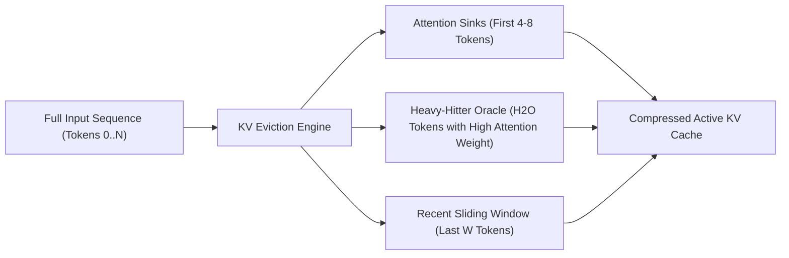

# Intelligent KV Cache Manager (`kv_manager/`)

The `kv_manager` package controls Key-Value attention cache memory, featuring attention-sink eviction policies, token importance scoring, and KV cache quantization.

---

## Attention-Sink Eviction Policies (`eviction.py`)

When context length exceeds VRAM budget, `IntelligentKVManager` applies attention-sink eviction strategies to retain critical tokens without re-computation:

### Eviction Strategies
1. **`h2o` (Heavy-Hitter Oracle)**: Keeps initial attention sinks, highest-attention "heavy-hitter" tokens, and the sliding local context window.
2. **`streaming_llm`**: Preserves initial 4 attention sink tokens + rolling local context window for infinite context generation.
3. **`lru`**: Standard Least Recently Used eviction.
4. **`fifo`**: First-In First-Out eviction.

---

## KV Quantization Modes (`quantization.py`, `compression.py`)

- **`FP16`**: Full 16-bit precision (default for high precision).
- **`Q8_0`**: 8-bit quantized KV cache (50% memory reduction with negligible perplexity loss).
- **`Q4_0`**: 4-bit quantized KV cache (75% memory reduction for extreme context extension).
