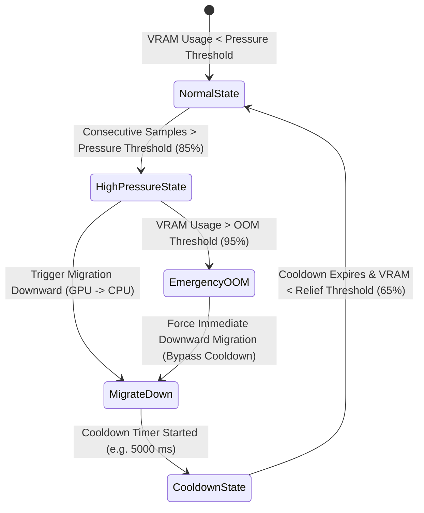

# Live Hysteresis Layer Migration (`layer_migration/`, `igpu_support/`)

The **Layer Migration Engine** provides real-time, hysteresis-controlled movement of transformer layers between dGPU, iGPU, and CPU memory domains during active inference.

---

## Hysteresis Controller Architecture (`hysteresis_controller.py`)

To prevent thrashing (rapid oscillating layer migrations), `HysteresisController` enforces dual-threshold state logic and cooldown periods:

---

## iGPU & Unified Memory Modeling (`igpu_support/`)

Integrated GPUs (such as AMD Radeon 780M/890M or Intel Arc iGPU) share main system RAM with the host CPU.

- **`ContentionModel` (`contention_model.py`)**: Models memory bandwidth contention when CPU cores and iGPU execution units simultaneously access system RAM over the same memory bus.
- **`PlacementContributor` (`placement_contributor.py`)**: Calculates the effective throughput penalty of assigning layers to iGPU vs dGPU vs CPU.
