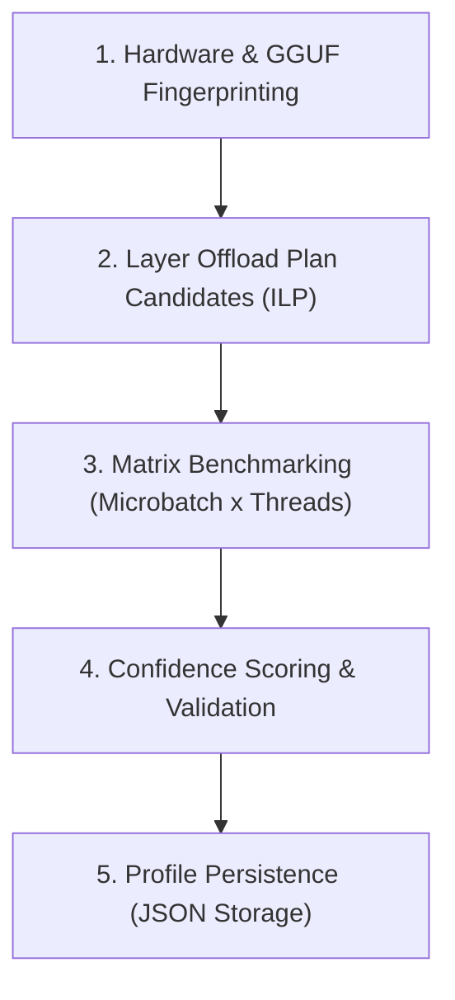

# Automatic Performance Optimizer (APO) (`optimizer/`)

The **Automatic Performance Optimizer (APO)** executes a 5-step search matrix to find, benchmark, validate, and cache the fastest layer offloading and thread configuration for any model on your hardware.

---

## 5-Step Optimization Pipeline



---

## CLI Integration

Run automated optimization for any model file via CLI:

```bash
inferenceos optimize models/llama-3-8b.Q4_K_M.gguf
```

Cached profiles are stored under `.inferenceos/profiles/` and re-used automatically on future runs.
