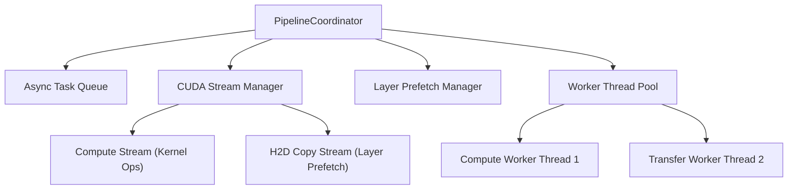

# Async Pipeline & Layer Prefetching (`async_scheduler/`)

The `async_scheduler` package provides multi-stage pipeline coordination, CUDA stream management, layer prefetching, and multi-worker task queues.

---

## Subsystem Architecture

---

## Key Modules

- **`PipelineCoordinator` (`pipeline_coordinator.py`)**: Coordinates pipeline stages (prefill ingestion, decode generation, KV synchronization) across worker threads.
- **`CUDAStreamManager` (`cuda_stream_manager.py`)**: Allocates independent CUDA streams for async memory transfers (Host-to-Device) overlapping with matrix compute operations.
- **`PrefetchManager` (`prefetch_manager.py`)**: Prefetches next-segment model weights over PCIe ahead of compute execution.
- **`WorkerPool` & `TaskQueue` (`worker_pool.py`, `task_queue.py`)**: Asynchronous thread pool dispatching token generation jobs and telemetry loggers.
