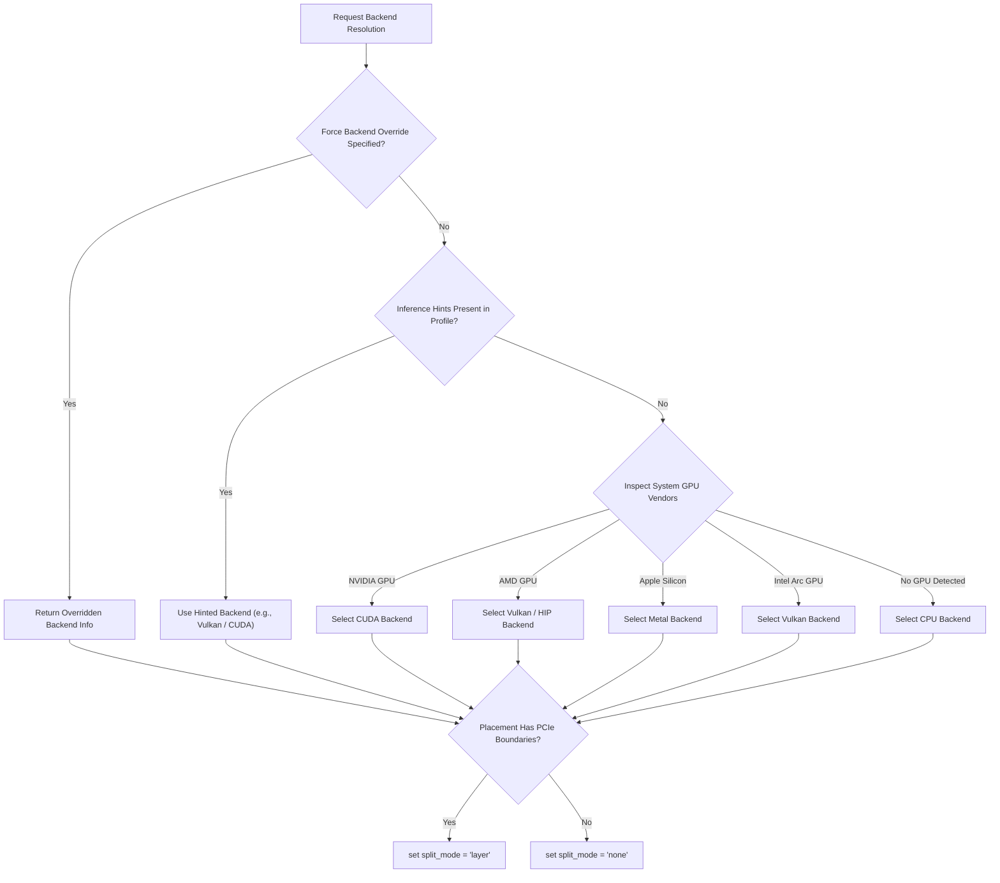

# Multi-Vendor Backend Selector (`inference_runtime/backend_selector.py`)

The `BackendSelector` module resolves the optimal hardware backend (`cuda`, `rocm`, `vulkan`, `metal`, or `cpu`) based on system hardware profiles, GPU vendor signatures, driver capabilities, and model layer offload plans.

---

## Resolution Flow Chart

---

## Backend Feature Matrix

| Backend | Vendor Target | Environment Variable | FlashAttention | Split Mode |
| :--- | :--- | :--- | :---: | :---: |
| `cuda` | NVIDIA GPUs | `CUDA_VISIBLE_DEVICES` | ✅ | `layer` / `row` |
| `rocm` | AMD Radeon / Instinct | `HIP_VISIBLE_DEVICES` | ✅ | `layer` |
| `vulkan` | AMD, Intel, NVIDIA | `GGML_VULKAN_DEVICE` | 🟡 Basic | `layer` |
| `metal` | Apple M-Series | Default | ✅ | `none` (Unified) |
| `cpu` | Generic x86_64 / ARM64 | `OMP_NUM_THREADS` | ❌ | `none` |
