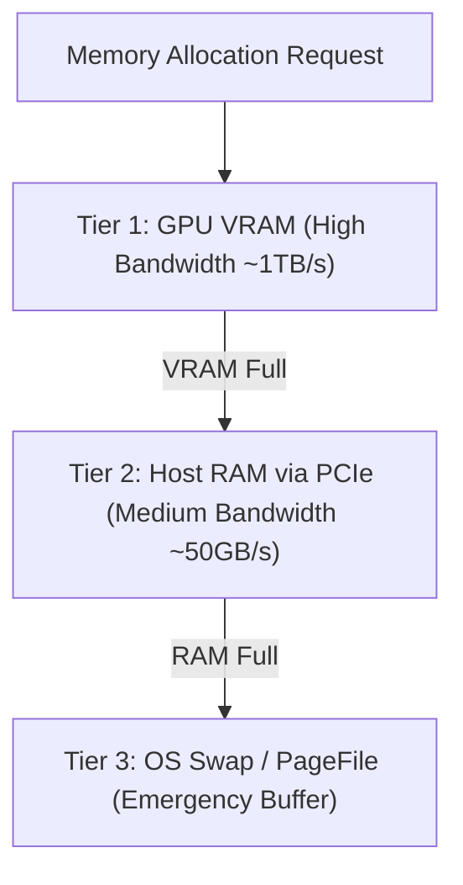

# Tiered Memory Scheduler (`scheduler/memory_scheduler.py`)

The **Memory Scheduler** orchestrates multi-tiered memory offloading across GPU VRAM, System RAM, and Swap spaces.

---

## Memory Tiering & Policies

### Supported Strategies (`memory_policies.py`)
- **`max_vram`**: Offload maximum possible layers to VRAM; spill remainder to RAM.
- **`balanced`**: Distribute layers proportionally to prevent RAM or VRAM pressure bottlenecks.
- **`conservative`**: Maintain generous VRAM headroom (25%+) for large batching and long context expansions.
