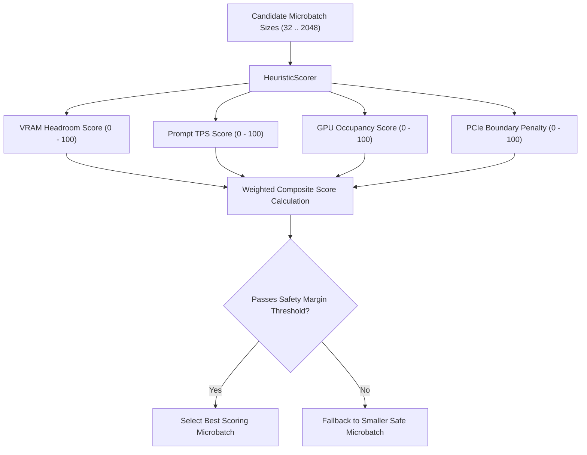

# Dynamic Microbatch Scheduler (`scheduler/microbatch_scheduler.py`)

The **Dynamic Microbatch Scheduler** replaces fixed prompt prefill batch configurations (such as `-b 512`) with an intelligent, hardware-aware candidate evaluation matrix. It executes immediately before inference begins, selecting the largest safe prefill microbatch size that maximizes prompt ingestion throughput while preventing VRAM spikes and OOM crashes.

---

## Scoring Matrix & Candidate Assessment

The scheduler evaluates candidate batch sizes $B \in \{32, 64, 128, 256, 512, 1024, 2048\}$ against four primary heuristic scores:



---

## Heuristic Formulas

1. **Prefill VRAM Headroom**:
   $$\text{VRAM}_{\text{prefill}} = B \times N_{\text{gpu\_layers}} \times D_{\text{hidden}} \times 2 \times 1.25$$
   If $\text{VRAM}_{\text{prefill}} > \text{VRAM}_{\text{free}} \times (1 - \text{safety\_margin})$, the candidate is flagged unsafe.

2. **GPU Occupancy Score**:
   $$\text{Occupancy} = \min\left(100, \frac{B}{\text{CU\_count} \times 16} \times 100\right)$$

3. **PCIe Boundary Penalty**:
   $$\text{Penalty} = \text{crossings} \times \left(\frac{B \times D_{\text{hidden}} \times 2}{1024^2 \times \text{PCIe\_BW}}\right)$$

---

## Python Usage Example

```python
from scheduler import MicrobatchScheduler, SchedulerConfig

scheduler = MicrobatchScheduler(config=SchedulerConfig(safety_margin=0.15))

decision = scheduler.select_microbatch(
    model_metadata={"hidden_size": 4096, "num_layers": 32},
    context_length=4096,
    vram_free_mb=6144.0,
    ram_free_mb=16384.0,
    gpu_utilization=20.0,
)

print(f"Selected Microbatch: {decision.microbatch}")
print(f"Confidence:          {decision.confidence:.2%}")
print(f"Estimated VRAM:      {decision.estimated_vram_gb:.2f} GB")
```
